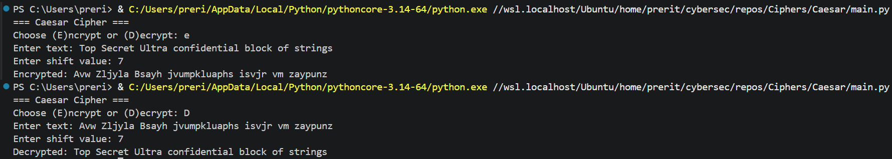
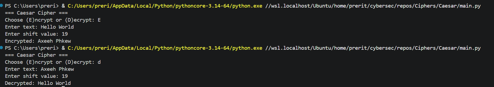

# Caesar Cipher in Python

A simple implementation of the Caesar Cipher encryption & decryption algorithm.

## How it works :

It basically shifts the letters of a block of text (string) by given number of spaces.

Say, shift is 5 then a will become e, b -> f and so on until z->c

Similarily, while decrypting this process is reversed so c->z , b->y, a->x etc.

## Run

```bash
python main.py
```

## Sceenshots containing example usage




